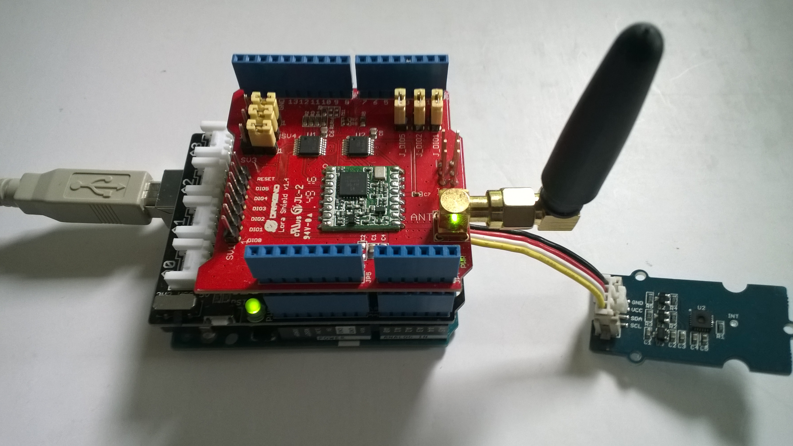

# FieldGateway.LoRa.DuinoClient
Sample duno client for my Windows 10 IoT Core LoRa field gateways

This is a demo duino client (based on one of the examples from Arduino-LoRa) that uploads telemetry data to my Windows 10 IoT Core on Raspberry PI field gateways. 

Bill of materials (Prices as at Nov 2018) 

Device

*[Arduino Uno R3](https://www.seeedstudio.com/Arduino-Uno-Rev3-p-2995.html) USD24.95

*[Seeeduno V4.2](https://www.seeedstudio.com/Seeeduino-V4-2-p-2517.html) USD6.95

LoRa shield

*[Dragino 433/868/915Mz](http://www.dragino.com/products/lora/item/102-lora-shield.html) USD21.00

*[Elecrow 915MHz](https://www.elecrow.com/lora-rfm95-shield-915mhz.html) USD15.90

*[MakerFabs 433MHz](https://makerfabs.com/index.php?route=product/product&product_id=131) USD15.60

*[MakerFabs 868MHz](https://makerfabs.com/index.php?route=product/product&product_id=130) USD15.60

Extras

*[SeeedStudio Grove-Temperature & Humidity Sensor](https://www.seeedstudio.com/Grove-Temperature%26Humidity-Sensor-%28High-Accuracy-%26-Mini%29-p-1921.html) USD11.50

*[SeeedStudio Grove-Universal 4 Pin Buckled 5cm Cable](https://www.seeedstudio.com/Grove-Universal-4-Pin-Buckled-5cm-Cable-%285-PCs-Pack%29-p-925.html) USD1.90

For the Arduino test client I also used

*[SeeedStudio Grove-Base Shield V2](https://www.seeedstudio.com/Base-Shield-V2-p-1378.html) USD4.45

